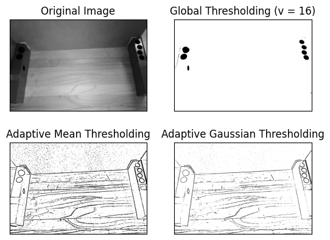
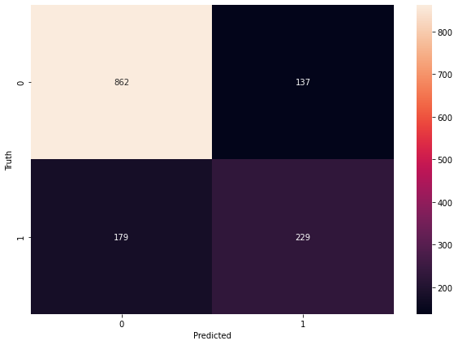
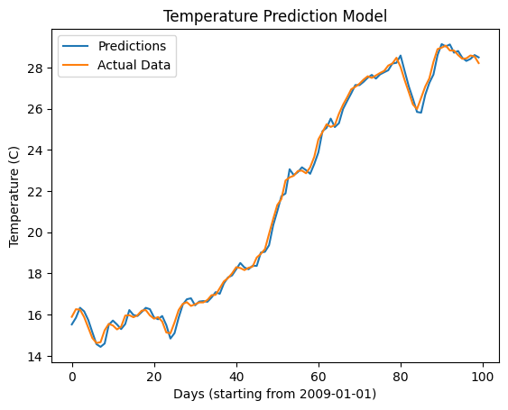

# Aspiring Data Engineer and Data Scientist 

## Education
**Management Engineering, BASc. at the University of Waterloo**

## Projects

### [Computer Vision Model](https://github.com/leo-cf-tian/toyota-innovation-challenge)
Developed a computer vision model using Python and Roboflow to win **1st place in the Toyota Innovation Challenge**. Preprocessed image data with adaptive equalization and data augmentation, tripling the dataset. Trained Ultralytics’ YOLOv8 model using transfer learning for efficient and accurate results.

  

  
   

### [Bank Customer Churn Classification Model](https://github.com/yashjagri/bank_churn_model)
Developed a deep learning model to predict customer churn in the banking sector, identifying factors contributing to customer attrition. Leveraged metrics such as precision, recall, and F1-score to evaluate model performance, ensuring actionable insights for retention strategies.

### [LSTM Climate Forecasting Model](https://github.com/yashjagri/LSTM-Climate-Forecasting-Model/tree/main)
This project uses an LSTM (Long Short-Term Memory) neural network to predict future climate data, such as temperature, rainfall, or other environmental metrics, based on historical time-series data.

## Work Expirience 

### Data Engineer @ Kenna (Janurary 2024 - April 2024, September 2024 - Present)
*   Engineered automated data pipelines using SQL to efficiently transfer 100,000+ rows daily into Tableau dashboards
*   Designed data warehouses on AWS Redshift, enabling real-time analytics, resulting in a 75% improvement in reporting efficiency
*   Analyzed over 3TB of complex datasets with SQL and Python, uncovering patterns that drove data-driven strategies
*   Created data quality frameworks with Python and Apache Airflow, reducing errors by 8% across reporting

### Business Intelligence Developer @ Ontario Ministry of Public and Business Service Delivery (May 2023 - Aug 2023)
*   Integrated external systems and APIs to ensure reliable data flow across government operations, minimizing downtime by 28%
*   Optimized ETL pipelines on AWS to convert raw data into actionable insights, driving data-driven decision-making
*   Developed scalable, low-code web applications improving performance and enhancing user experience for 5000+ users

### Data Analyst @ Sunlife Financial (May 2022 - August 2022)
*   Designed interactive dashboards in Power BI to track data ingestion trends, reducing analysis time by 67%
*   Developed a cloud-based enterprise solution integrating IoT and AI technologies, increasing operational efficiency for clients
*   Collaborated with cross-functional teams to gather feedback and iteratively refine the estimation sheet
*   Automated data pipelines by creating Excel VBA macros to transfer datasets to a PostgreSQL database, resulting in a 40%
improvement in process efficiency and reducing manual errors

